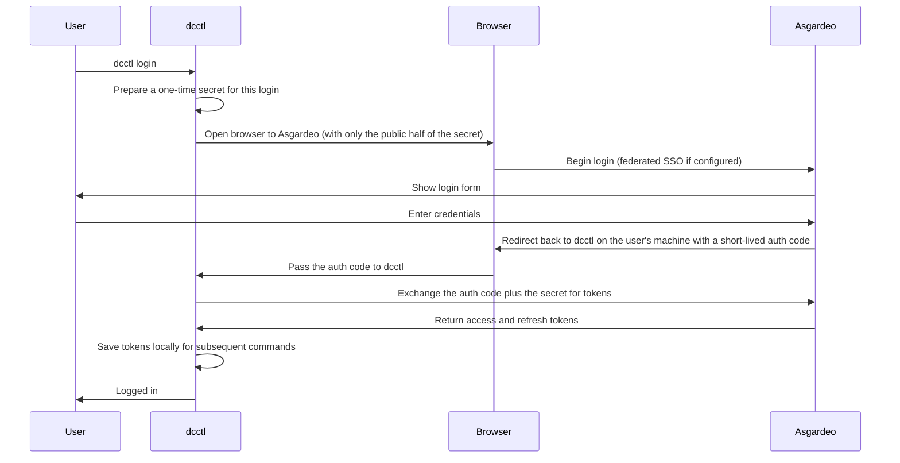
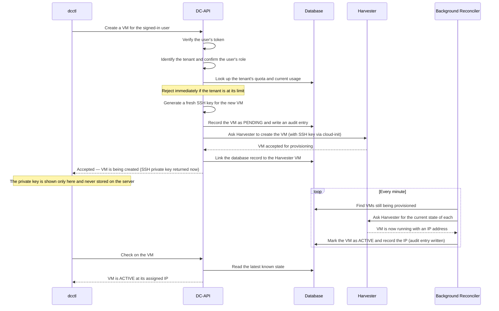

# 1. Purpose

This document is the longer, technical companion to the kickoff email
sent to the Architecture Group. The email gave the shape of the
Sovereign Cloud Control Plane and what currently works; this document
expands on each part — the system boundary, the request flow, the
engineering standards behind it, and the current state of each
milestone including work that is actively in flight.

It is intended as a reference, not a proposal: the proposal phase has
passed and the system is running. The goal here is to give anyone
joining the conversation enough context to engage critically — to
push back on the boundary choices, the abstractions, or the
operational model before they harden further.

What this document is **not**: a developer onboarding guide, an
operator runbook, or an API reference. Those live elsewhere in the
repository (`docs/dc-api-architecture.md`, `docs/ops-bootstrap.md`,
`dc-api/openapi.yaml`). When something here is ambiguous, the code
and the OpenAPI specification are the source of truth.

---

# 2. The big picture

The WSO2 LK Datacenter is a Harvester-on-bare-metal deployment with
Rancher managing Kubernetes cluster lifecycles. The first iteration
of tenant access was a set of Terraform modules
(`open-cloud-datacenter`) that wrapped the Harvester and Rancher
providers directly. That approach worked for the first handful of
teams but does not scale: every team has to learn Harvester
namespaces, Rancher project semantics, and two separate credential
lifecycles. RBAC and quota enforcement remain manual. With EU and
US datacenters on the horizon, the operational debt would grow
linearly with team count and geographically with each new region.

The **Sovereign Cloud Control Plane** replaces that model. It is a
Go REST service (`DC-API`) that turns the LK Datacenter into a
self-service cloud. Tenants interact with it through a CLI today
(`dcctl`), a web portal and Terraform provider in the near future,
and never see Harvester or Rancher. Asgardeo is the single identity
layer. PostgreSQL is the system of record for everything the
platform manages. Quotas, role-based access, audit, tenancy
boundaries and the resource model are enforced in code we own; the
underlying platforms are implementation detail and could be swapped
without touching the public contract.

```
                              ┌──────────────────────────────┐
                              │       Asgardeo (OIDC)        │
                              │   Authentication & groups    │
                              └──────────────┬───────────────┘
                                             │ JWT validation
                                             ▼
   ┌──────────────┐       HTTPS        ┌─────────────┐         ┌──────────────────┐
   │   dcctl      │ ─── Bearer JWT ──► │             │ ──────► │   PostgreSQL     │
   │   (CLI)      │                    │             │ ◄────── │  state, audit,   │
   └──────────────┘                    │   DC-API    │         │  quotas, RBAC    │
   ┌──────────────┐                    │  (Go REST)  │         └──────────────────┘
   │ Terraform    │ ─── Bearer JWT ──► │             │
   │ Provider     │                    │             │ ──────► ┌──────────────────┐
   │ (later)      │                    │             │ ◄────── │   Harvester      │
   └──────────────┘                    │             │         │   KubeVirt VMs   │
   ┌──────────────┐                    │             │         │   via dynamic    │
   │   Web UI     │ ─── Bearer JWT ──► │             │         │   k8s client     │
   │  (early)     │                    │             │         └──────────────────┘
   └──────────────┘                    │             │
                                       │             │ ──────► ┌──────────────────┐
                                       │             │ ◄────── │   Rancher        │
                                       │             │         │  RKE2 clusters   │
                                       │             │         │  via REST v3     │
                                       └─────────────┘         └──────────────────┘
```

Three properties of this picture are worth pulling out explicitly,
because every subsequent decision in the design follows from them.

**DC-API owns the contract.** Tenants and clients depend on the
`/v1/...` REST API and nothing else. Replacing Harvester with
OpenStack, replacing Rancher with a different Kubernetes provisioner,
or moving Asgardeo behind a federation layer are all changes that
should not require a public API change. This is enforced in code
through the Strategy Pattern: handlers depend on `ComputeProvider`,
`ClusterProvider` and `NetworkProvider` interfaces, never on the
concrete `harvester` or `rancher` or `kubeovn` packages. The promise
is that backend changes are private engineering work.

**Credentials never propagate.** DC-API holds one master Harvester
kubeconfig and one Rancher admin token. Tenants are granted DC-API
roles (owner, member, viewer) on a scope; they never receive
Harvester or Rancher credentials. This is the second-strongest
isolation guarantee in the design — the first being network
isolation at the OVN layer (covered in §7). Any privilege escalation
attack against a tenant cannot pivot into Harvester or Rancher,
because the attacker has no credentials to pivot with.

**The database is the system of record.** Every VM, cluster, volume,
VPC, subnet, peering and role assignment is one PostgreSQL row owned
by DC-API. A background reconciler keeps the database in sync with
the underlying providers (a Kubernetes-controller-style pattern).
This is what makes drift detection, audit trails, quota enforcement
and consistent listing behaviour possible. It is also what makes
the API honest about state — a GET that returns "ACTIVE" reflects
what DC-API verified, not what a tenant told us.

---

# 3. Components in a paragraph

**DC-API server.** A single Go binary, stateless, deployed as a
Kubernetes Deployment on the `dcapi-controlplane-rke2` cluster
running inside Harvester. It validates JWTs against Asgardeo's JWKS
on every request, enforces per-tenant quotas before any backend
call, generates SSH keys for VMs (returned once and never stored),
proxies state-changing operations to the appropriate provider, owns
a PostgreSQL row for every resource, and runs a background
reconciler that polls providers and syncs state. Key dependencies:
chi router, zerolog structured logging, pgx for PostgreSQL,
`client-go` dynamic client for Harvester and KubeOVN CRDs, plain
`net/http` for Rancher.

**dcctl CLI.** A Cobra-based command-line tool distributed to
engineers. Authenticates via OIDC Authorization Code with PKCE — no
client secret is embedded because the binary is public. Tokens are
cached locally. The CLI today supports the full M1 + M1.5 + M2
surface: VMs, clusters, images, networks/VPCs/subnets/peerings,
members, service accounts, kubeconfig retrieval.

**Web UI (early).** A React + Fluent UI prototype, internal-only at
this stage, that consumes the same OpenAPI specification as the CLI
via an auto-generated TypeScript client. The UI is not yet exposed
to tenants; it is being developed alongside the M2 surface to make
sure the API shape is actually usable from a portal context (a
forcing function that catches API issues a CLI-only consumer would
not catch). It will be promoted to general availability once M2
networking is fully validated end-to-end.

**Terraform provider (planned).** `terraform-provider-dcapi` is on
the roadmap for M4. It will consume the same OpenAPI specification
via `oapi-codegen`. This is the path for teams who already manage
application infrastructure in Terraform and want to manage their
DC-API resources in the same workflow without touching the
underlying Harvester or Rancher providers.

**PostgreSQL.** Six tables today, all owned by DC-API: `resources`
(one row per VM/cluster/volume/VNet/subnet/peering),
`role_assignments` (scope-polymorphic, M5-forward-compatible RBAC),
`service_accounts` (CI tokens, bcrypt-hashed), `audit_events`
(append-only log of every state change), `quotas` (per-tenant
limits), `vpc_external_ips` (the per-VPC SNAT EIP allocation table
introduced with F15). UUID primary keys throughout. JSONB metadata
columns where flexibility outweighs schema rigour.

**Harvester.** The hypervisor. DC-API talks to it through the
Kubernetes dynamic client because Harvester resources are CRDs
(KubeVirt `VirtualMachine`, `VirtualMachineImage`, etc.) — there is
no first-class REST API or Go SDK. This is the same interface a
Kubernetes controller would use; choosing it rather than a
private SDK keeps the integration durable across Harvester upgrades.

**Rancher.** Cluster lifecycle. DC-API drives it via Rancher's
documented REST v3 API rather than the `rancher2` Terraform
provider, which has known bugs around RKE2 cluster provisioning.
Kubeconfig retrieval is on-demand and never cached server-side.

**KubeOVN.** The SDN that powers tenant VPC networking (M2). DC-API
provisions `Vpc`, `Subnet`, `VpcPeering`, `VpcNatGateway`,
`IptablesEIP`, `IptablesSnatRule` and `NetworkAttachmentDefinition`
custom resources to give each tenant isolated overlay networks with
automatic outbound internet access and per-VPC DNS. The KubeOVN
install runs on the Harvester cluster itself as a multus secondary
CNI — see §7 for the architectural rationale.

**Asgardeo.** The identity provider. DC-API trusts exactly one
issuer. Tenant isolation is enforced via Asgardeo groups
(`dc-tenant-<name>`) mapped to DC-API roles in our own code, not in
Rancher. Enterprise tenants whose engineers need corporate SSO use
Asgardeo's federation capability transparently; DC-API still sees
one trusted issuer.

---

# 4. How a call flows

Two flows show the architectural pattern that every other operation
follows: sign-in (PKCE) and resource creation (async, quota-gated,
reconciler-tracked). The cluster, volume and VPC flows are identical
in shape — only the backend differs.

## 4.1 Signing in

PKCE is used because the CLI binary is public. The "secret" in the
diagram below is the PKCE code verifier; the "public half" is its
SHA-256 hash. The point of PKCE is that an attacker intercepting the
browser redirect cannot exchange the auth code for tokens without
also knowing the private half, which never leaves the local
machine.



## 4.2 Creating a virtual machine

VM provisioning takes two to five minutes; cluster provisioning
takes ten to fifteen. A synchronous API would time out, force long
client-side waits, and make the API feel sluggish even when the
backend is healthy. The pattern is therefore: validate, authorise,
quota-check, persist as `PENDING`, kick off the backend operation,
and return `202 Accepted` with a resource identifier. A background
reconciler watches the database, polls the backend, and transitions
state forward. Clients poll the resource by ID until it reaches a
terminal state.

The same pattern generalises to delete (transitions through
`DELETING` until the backend confirms removal), to cluster
creation, to volume attachment, to VPC provisioning. State machine
transitions are uniform across resource types so that clients and
the future Terraform provider can implement a single polling helper.



A few details that the diagram is intentionally quiet about, but
which matter architecturally:

- The order **database first, backend second** is deliberate. If the
  backend call fails, the row in `PENDING` becomes a sentinel that
  the reconciler observes and either retries or marks `FAILED`.
  The inverse order (backend first, database second) would create
  orphan VMs whenever DC-API crashed between the two operations.
- SSH key material is generated inside DC-API, returned to the
  caller exactly once in the `202` response, and never persisted.
  The public half is injected into the VM through cloud-init; the
  private half exists only on the caller's machine after the
  response is received.
- The reconciler is a singleton today; running multiple replicas
  would require leader election to avoid duplicate provider calls.
  This is on the roadmap as part of HA work but is not on the
  critical path.

---

# 5. Use cases — what tenants actually do today

**A team onboards and provisions an environment.** The IaaS team
adds an engineer to an Asgardeo group (`dc-tenant-<team>`) — a
two-minute operation, one-time per engineer. From that point the
engineer self-serves:

```
dcctl login
  → Browser opens, Asgardeo login, token cached locally.

dcctl create vm --name api-01 --size medium \
  --image default/ubuntu-24-04 --network default/vm-net-100
  → ACTIVE in ~3 min. SSH private key returned once.

dcctl create cluster --name k8s-prod --size large --nodes 3 \
  --image default/ubuntu-24-04 --network default/vm-net-100
  → ACTIVE in ~12 min.

dcctl kubeconfig k8s-prod --file ~/.kube/k8s-prod.yaml
kubectl get nodes
  → Ready. No Rancher login ever touched.
```

No Terraform, no Harvester logins, no Rancher logins. The engineer
does not know which Harvester node their VM is on, what namespace
it lives in, or which Rancher project owns their cluster — and they
should not have to.

**A team lead manages who can do what.** Owner / member / viewer
roles are assigned per tenant. Service accounts are first-class for
CI pipelines.

```
dcctl tenant add-member alice@acme.com --role member
dcctl tenant create-service-account ci-runner --role member
  → DC-API-issued token returned exactly once; CI uses it as a Bearer.
```

The role model is scope-polymorphic from day one — roles bind to a
`(scope_type, scope_id)` pair. Today `scope_type` only takes the
value `tenant`. When the Organisation → Subscription → Resource
Group → Resource hierarchy lands (M5), it becomes
`subscription`, `resource_group`, `resource` without migrating any
existing rows.

**A team builds an isolated network for its workloads.** M2
networking is in active development. Tenants create their own
overlay networks (VPCs in Azure terminology) with subnets,
peering, and automatic outbound internet access. Cross-tenant
traffic is impossible by construction — the isolation is enforced
at four independent layers (Geneve encapsulation, OVN logical
router separation, OVN ACLs, and API-level peering validation).

```
dcctl create vnet team-prod-net --address-space 10.20.0.0/16 --region lk
dcctl create subnet --vnet team-prod-net --name app  --cidr 10.20.1.0/24
dcctl create subnet --vnet team-prod-net --name data --cidr 10.20.2.0/24
dcctl create peering --vnet team-prod-net --peer-vnet team-dev-net --name dev-bridge
```

**Audit and quota are first-class.** Every state change is recorded
in an append-only `audit_events` table — never updated, never
deleted. Per-tenant quotas (VM count, cluster count, CPU, memory)
are validated before any backend call and surfaced back to the
tenant. Both are standard requirements for multi-tenant
infrastructure, deliberately built in at M1 rather than retrofitted.

**CI/CD without bespoke credentials.** Pipelines authenticate to
DC-API with a service-account token bound to a least-privilege
role. No Harvester or Rancher kubeconfigs in CI. No humans rotating
tokens on a calendar. The audit trail makes service-account
activity distinguishable from human activity, and tokens can be
revoked independently when a pipeline is decommissioned.

---

# 6. Built on standards, not bespoke

The design leans on mainstream standards so that the surface is
predictable to anyone joining and the abstractions are honest. The
short list:

- **OpenAPI 3.0.3** as the API contract. `dc-api/openapi.yaml` is
  the source of truth. The handler and the spec ship in the same
  pull request; reviewers reject PRs that change behaviour without
  updating the spec. The web UI auto-generates its TypeScript
  client from the spec on every build (via `openapi-fetch`), and
  the planned Terraform provider and Go SDK will consume the same
  spec via `oapi-codegen`. This is what gives confidence that
  three independent clients will not drift from the contract.
- **OIDC + OAuth 2.0 with PKCE** for client authentication —
  RFC 7636, the standard pattern for public clients. JWTs are
  validated against Asgardeo's JWKS endpoint on every request.
- **HTTP semantics, not RPC-over-HTTP.** Asynchronous creates
  return `202 Accepted` with a polling URL; reads are `GET`; state
  changes use the verb that matches the intent; errors use
  conventional 4xx/5xx codes.
- **An Azure-shaped resource hierarchy.** Organization →
  Subscription → Resource Group → Resource. Familiar to anyone who
  has used Azure or AWS, and chosen so tenants do not have to
  learn vocabulary that is specific to us.
- **Twelve-factor configuration.** All runtime configuration is
  environment variables (`DCAPI_*` prefix). No config files are
  baked into the image; the same image runs in dev, staging and
  production.
- **Named design patterns.** Strategy (provider interfaces),
  Factory (provider selection), Repository (all SQL in one place),
  Dependency Injection (composition root in `router.go`),
  Middleware Chain (auth, logging, RBAC). Named patterns over
  clever one-offs — easier for anyone who has read a Go service
  before to navigate.
- **Kubernetes-native backend integration.** Harvester is driven
  through the Kubernetes dynamic client against KubeVirt and
  KubeOVN CRDs. Rancher is driven through its documented REST v3
  API. No private SDKs, no scraped UI calls.
- **Structured logging plus append-only audit.** All logs are JSON
  (zerolog). State changes are recorded in `audit_events` and
  never modified. Both are standard for multi-tenant infrastructure
  and were in from M1 rather than retrofitted.
- **Production basics.** Distroless non-root container images,
  multi-stage Docker builds, Conventional-Commits-style git
  history, GitHub Actions CI/CD with an in-cluster self-hosted
  runner so no external `KUBECONFIG` secret has to live anywhere.

If any of these choices looks wrong from where you sit, it is
much cheaper to push back now than after the first external
consumer ships against the API.

---

# 7. Current state by milestone

| Milestone | Scope | Status |
|---|---|---|
| **M1 — Compute & Clusters** | VM and RKE2 cluster CRUD, quotas, Asgardeo auth, `dcctl` CLI, audit trail, reconciler. | ✅ Shipped and running in LK dev at `dcapi.lk.internal.wso2.com`. |
| **M1.5 — RBAC** | Owner / member / viewer roles, CI service accounts, scope-polymorphic schema forward-compatible with the M5 hierarchy. | ✅ Shipped. 53 integration tests cover the role-by-verb matrix and the service-account lifecycle. |
| **M2 — Networking** | KubeOVN VPCs, subnets, peering, automatic per-VPC SNAT, per-VPC DNS. | 🟡 In active development. VPC / subnet / peering API is live; F15 (automatic outbound SNAT) and F20 (per-VPC DNS) have shipped this week. VM-on-VPC attachment is the open gap and is the next chunk. |
| **M2 — Storage** | Volumes, snapshots, load balancers, storage quota. | 🔵 Designed, not started. |
| **M3 — Managed services** | PostgreSQL, Valkey, Harbor, DNS, TLS as single API calls. | 🔵 Designed, not started. |
| **M4 — Web portal & Terraform provider** | Self-service UI, `terraform-provider-dcapi`, cost dashboard. | 🟡 Web portal prototype already exists internally (consumes the same OpenAPI spec); Terraform provider not started. |
| **M5 — Organisation hierarchy** | Org → Subscription → Resource Group → Resource. | 🔵 Designed, deferred — flat tenant model is sufficient until external customers join. |
| **DC-API bootstrap** | Codify the LK-dev bootstrap as Terraform so EU and US datacenters can come up the same way. | 🟡 Manual run for LK-dev is succeeding; modularisation is the next cross-cutting deliverable. |

Two specifics worth flagging for this audience:

**Networking is the active frontier.** KubeOVN was chosen as Model B
— self-managed upstream KubeOVN as a multus secondary CNI on the
Harvester cluster — because Harvester's own bundled KubeOVN VPC
support is still labelled experimental as of v1.8 and we did not
want our public VNet API stability tied to a vendor-experimental
feature. The spike (five gate criteria: IP allocation, cross-subnet
ACL, live migration with IP/MAC preserved, deterministic ACL
toggle, no regression on legacy VMs) passed cleanly. Model B is
the working stack today; the migration path to Model A (Harvester's
bundled KubeOVN) when it GAs is a swap of the `NetworkProvider`
driver, not an API change.

**The web portal exists but is intentionally quiet.** A React +
Fluent UI front-end is built against the same OpenAPI specification
that the CLI uses. It is internal-only at this stage — the
priority is to finish M2 networking and tighten the API contract
before exposing the portal to tenants. The portal's existence is
mentioned here because it has been an effective forcing function:
issues that a CLI consumer would not notice (e.g. how list
endpoints paginate, how error bodies are structured) have surfaced
earlier because the portal exercises the same contract from a very
different angle.

---

# 8. Architectural decisions worth flagging

A handful of decisions are load-bearing enough that they merit a
named mention. Each one was deliberate and has alternatives that
were considered and rejected.

**DC-API hierarchy is independent of Rancher and Harvester.**
Tenants see Organisation → Subscription → Resource Group → Resource.
Rancher projects, Harvester namespaces, KubeVirt resources — these
are internal plumbing and never appear in the public API or in
tenant-facing CLI output. If we replace Rancher tomorrow, the
hierarchy and the API do not change. This is the single most
consequential choice in the design and the reason the Strategy
Pattern is enforced rigorously in the code.

**Tenant isolation is dual-layer.** Network isolation at the OVN
layer (Geneve encapsulation, logical router separation,
default-deny ACLs) plus RBAC at the API layer (`tenant_id` is the
isolation boundary in every database query, enforced before any
backend call). Defeating one of the two is not enough to break
across tenants. Cross-tenant peering has no API surface — it is
not "disabled by default", it is "not possible to propose".

**The asynchronous-with-reconciler pattern is uniform.** Every
resource type uses the same `PENDING → ACTIVE` / `DELETING →
removed` state machine. Clients can write one polling helper that
handles VMs, clusters, volumes and VPCs identically. This is also
what makes the database the source of truth: the reconciler is the
component that turns the database from "what the tenant asked for"
into "what is actually running".

**KubeOVN is Model B on purpose.** Self-managed upstream KubeOVN
instead of Harvester's bundled-but-experimental version, because
the public VNet API stability cannot be tied to a vendor's
experimental feature flag. Reassessment is scheduled for Harvester
v1.9 GA. The migration path between the two is a `NetworkProvider`
driver swap.

**RBAC scope is polymorphic from day one.** Role assignments bind
to a `(scope_type, scope_id)` pair where `scope_type` is a string.
Today it only takes the value `tenant`. When M5 lands it becomes
`subscription`, `resource_group`, `resource` — without migrating
any existing rows or changing the authorisation code. This is the
forward-compatibility lever that keeps the M5 hierarchy from being
a breaking change.

**AI-assisted development is part of the engineering workflow.**
The codebase has been built with substantial AI assistance, used to
shorten the explore-and-validate loop and to run multiple
investigations in parallel. This is acknowledged here because the
pace of delivery is part of why the document exists at all — a
working CLI, RBAC, audit, and the beginnings of networking would
not exist this early in a traditional small-team timeline.

---

# 9. What's next, and how to engage

The near-term roadmap, in order:

1. Close the VM-on-VPC attachment gap so that tenants can launch
   VMs directly into their own subnets (rather than the legacy
   shared VLAN networks).
2. Run a full RKE2-on-VPC end-to-end test now that automatic
   per-VPC SNAT (F15) and per-VPC DNS (F20) have shipped. This is
   the gate that closes M2 networking as "done".
3. Ship storage (volumes, snapshots, load balancers) as the second
   half of M2.
4. Codify the LK-dev bootstrap as a Terraform module so EU and US
   datacenters can be stood up identically.
5. Promote the web portal from internal preview to tenant-facing
   alongside the start of M3 (managed services).

There are two things the Architecture Group is best placed to help
with right now:

**Sanity-check the boundary choices.** The DC-API / Harvester /
Rancher / KubeOVN / Asgardeo split is load-bearing — anything that
looks wrong about it is much cheaper to challenge now than after
the first external consumer ships. The async-with-reconciler
pattern and the "DC-API owns the contract" stance are the two
calls that, if wrong, would be most expensive to reverse.

**Surface adjacent consumers.** If a team you advise will eventually
consume DC-API (observability, identity beyond the basics,
container registry, CI/CD), it helps to know now so that the API
contract can be shaped with real consumer needs in mind rather than
inferred ones.

For deeper context, the repository contains:

- `dc-api/openapi.yaml` — the authoritative API contract
- `docs/dc-api-architecture.md` — developer-facing architecture detail
- `docs/dc-api-internal-proposal.md` — the original "why" document
- `docs/rbac.md` — the M1.5 RBAC operator guide
- `docs/m2-network-api-design.md` and `docs/m2-network-api-mapping.md`
  — the networking design and the KubeOVN gotchas captured during
  the spike
- `MILESTONES.md` — the live roadmap

A walkthrough session is available on request. The architecture
group e-mail thread is the right place to flag concerns,
adjacent-team consumers, or things this document should make
clearer.
